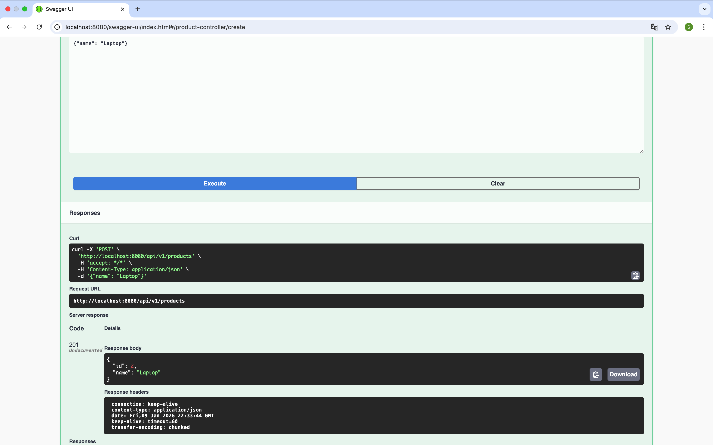
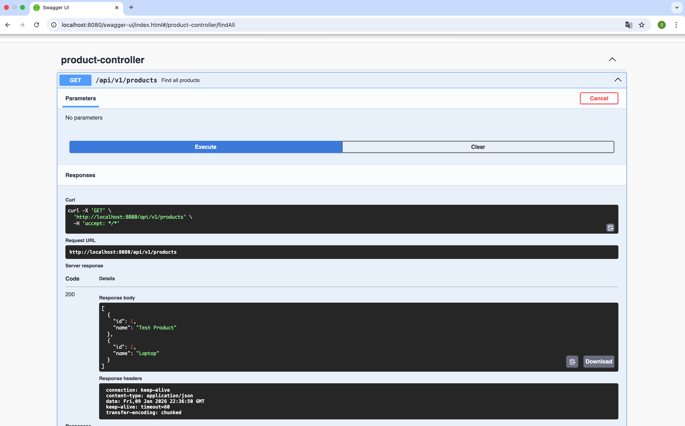

# First Rest Api Spring Project

**Student:** Saliya Komilova 73399 

## Project Overview
For this assignment, I developed a functional REST API for managing a product catalog. This is my second project using Spring Boot, where I applied a layered architecture and worked with database persistence. My main goal was to implement all CRUD operations and set up proper error handling.

## What I implemented in this work:

* **Layered Architecture**: I organized the code into clear layers: Controllers, Services, Repositories, and Domain models. This helps keep the code clean and manageable.
* **Full CRUD Operations**: I added the ability to Create, Read, Delete, and **Update (PUT)** products.
* **Database Integration (H2)**: I connected an in-memory H2 database. All products are saved into a real table using Spring Data JPA.
* **Exception Handling**: I configured a `@ControllerAdvice` so that instead of standard error pages, the server returns a clear JSON response (e.g., if a product ID is not found, it returns a 404 error).
* **Swagger Documentation**: I integrated Swagger UI. This is very convenient because you can test the API methods directly in the browser.

---

## How to run and test:

1.  **Run the project**: Open in IntelliJ IDEA and run `FirstRestApiSpringApplication.java`.
2.  **Test via Swagger**: Access `http://localhost:8080/swagger-ui/index.html` to interact with endpoints.
3.  **H2 Database Console**: Access the database at `http://localhost:8080/console` (use JDBC URL: `jdbc:h2:mem:testdb`).

### Available Endpoints:
* `POST /api/v1/products` — Create a new product (returns 201 Created).
* `GET /api/v1/products` — View the list of all products.
* `GET /api/v1/products/{id}` — Find a product by its ID.
* `PUT /api/v1/products/{id}` — Update an existing product.
* `DELETE /api/v1/products/{id}` — Remove a product from the database (Status 204).

---

## Functionality Screenshots

### 1. Interactive Documentation (Swagger UI)
Automated API overview and testing interface.

### 2. Creating a Product (POST Request)
Demonstration of successful resource creation with a **201 Created** status.

### 3. Data Retrieval (GET Request)
Fetching the list of products currently stored in the application.

### 4. H2 Database Verification
Direct view of the `PRODUCTS` table in the H2 console, verifying data persistence.

### 5. Custom Exception Handling (404 Not Found)
System response returning a custom error message when a product is not found.

